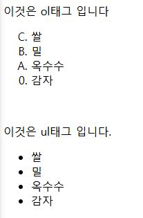

# HTML 태그 알아가기

## 1. List 계열 태그

1. `<ol>`

   -  order list, 순서가 있는 리스트에 사용
   -  Attributes 3종
      1. reversed : 순번을 거꾸로 매김
      2. start="num" : 순번을 num부터 시작
      3. type="" : 1,a,A,i,I 형태로 만듬

2. `<ul>`

   -  unorder list, 순서가 없는 리스트에 사용
   -  대부분의 목록에 광범위로 사용됨.
   -  자체 Attributes 없음

3. `<li>`
   -  ul혹은 ol의 하위 목록들에 쓰는 태그. 반드시 ol혹은 ul 안에 들어가야함.

### 예시 형태

```HTML
<p>이것은 ol태그 입니다.</p>
<ol resersed start="3" type"A">
    <li>쌀</li>
    <li>밀</li>
    <li>옥수수</li>
    <li>감자</li>
</ol>
<br/>
<p>이것은 ul태그 입니다.</p>
<ul>
    <li>쌀</li>
    <li>밀</li>
    <li>옥수수</li>
    <li>감자</li>
</ul>
```

#### 결과



---

## 2. table 태그

1. `<table>`
   -  table, 표를 만드는데 사용
   -  표를 만들기 위한 제일 상위 태그
2. `<caption>`
   -  표 전체의 제목의 역할
3. `<colgroup>`
   -  column 전체에 style 등을 적용하고 싶을 때 사용
   -  `<col>` 태그를 안에 넣어서 사용한다
4. `<tr>`
   -  table row, 하나의 열을 만든다.
   -  table 태그의 필수요소
5. `<th>` `<td>`
   -  tr태그 안에 들어가며, 하나의 셀을 만든다.
   -  Attribute 2종류
      1. rowspan="num" : num만큼 열 병합
      2. colspan="num" : num만큼 행 병합
6. `<thead>` `<tbody>` `<tfoot>`
   -  가독성을 위해 활용되는 태그
   -  thead는 맨 위에, tbody는 내용부분에, tfoot은 밑에 사용
